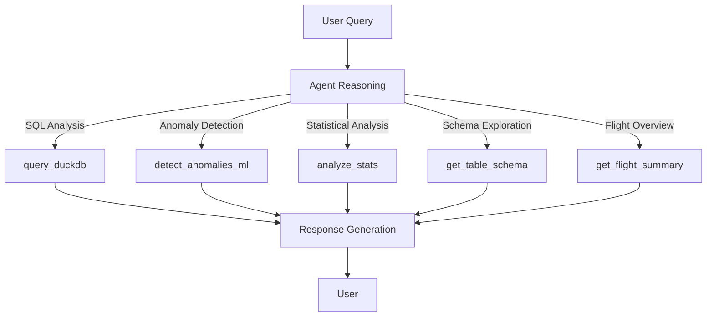
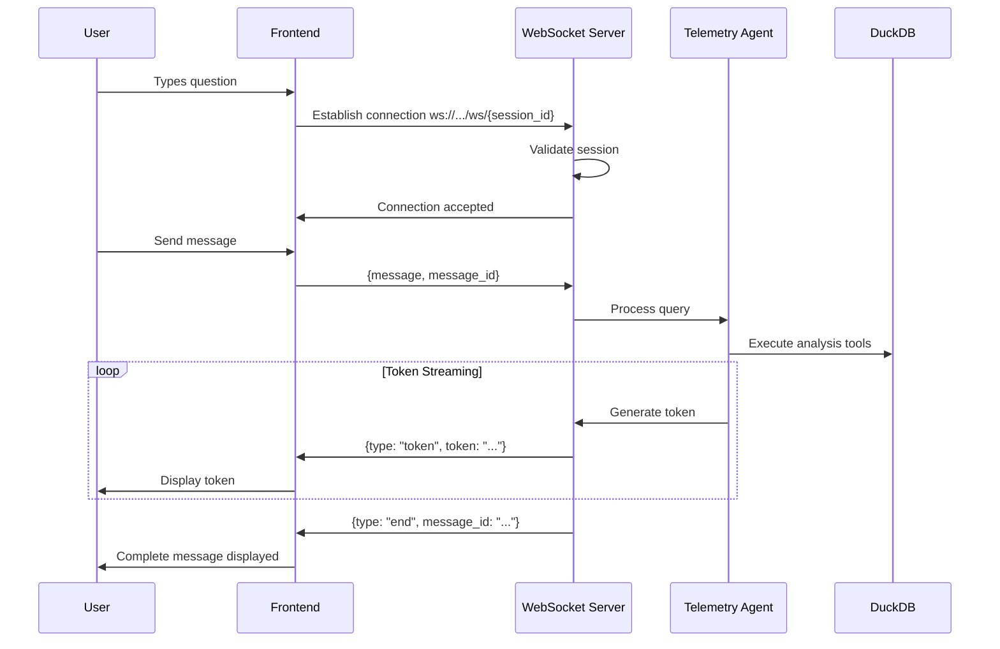
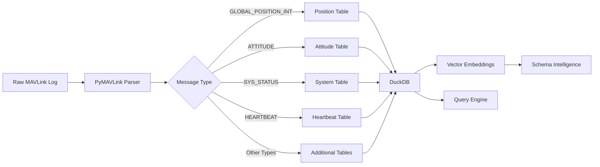
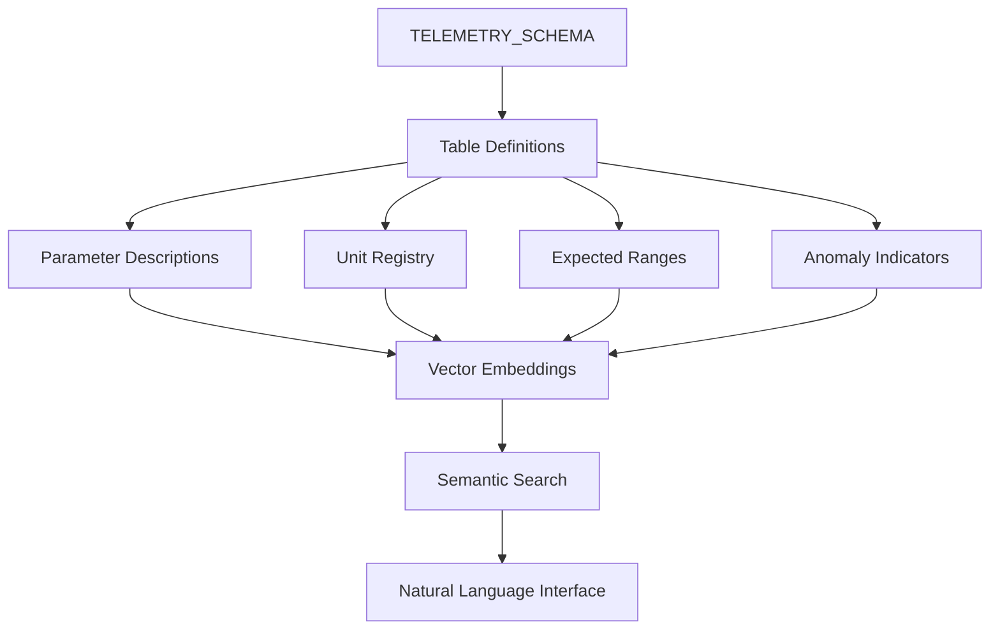
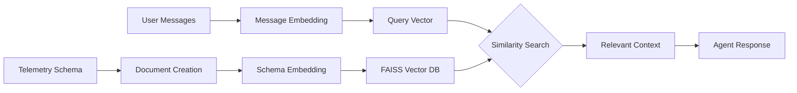

<div align="center">

# 🚁 UAV Log Viewer Agentic Chatbot

#### Advanced AI-powered telemetry analysis and natural language interface for UAV logs

[](https://github.com/yourusername/UAVLogViewer-AgentChatbot)
[](https://www.python.org)
[](https://fastapi.tiangolo.com)
[](https://langchain.com)
[](https://cursor.sh)
[](https://windsurf.ai)
[](LICENSE)

</div>

<p align="center">
  
</p>

> **Harness the power of AI to decode complex UAV telemetry data through natural language**

## 📑 Table of Contents

- [System Overview](#-system-overview)
- [Architecture](#-architecture)
- [Technologies & Tools](#-technologies-and-tools)
- [Installation & Setup](#-installation-and-setup)
- [API Documentation](#-api-documentation)
- [AI Agent Capabilities](#-ai-agent-capabilities)
- [WebSocket Integration](#-websocket-integration)
- [Telemetry Processing](#-telemetry-processing)
- [Security Considerations](#-security-considerations)
- [Contributing](#-contributing)

## 🚀 System Overview

The UAV Log Viewer is an advanced AI-powered system built with Cursor and Windsurf technologies that transforms how engineers analyze drone telemetry data. Instead of manually parsing complex flight logs, this system enables natural language interactions with your flight data through a sophisticated agentic chatbot.

<p align="center">
  
</p>

### ✨ Key Features

<table>
  <tr>
    <td><b>🔍 Natural Language Flight Analysis</b></td>
    <td>Ask complex questions about your flight data in plain English</td>
  </tr>
  <tr>
    <td><b>⚡ Real-time Token Streaming</b></td>
    <td>WebSocket-powered responses appear instantly, token by token</td>
  </tr>
  <tr>
    <td><b>🧠 Multi-strategy Memory</b></td>
    <td>Context-aware conversations with short, medium, and vector-based memory</td>
  </tr>
  <tr>
    <td><b>📊 Advanced Anomaly Detection</b></td>
    <td>ML-powered identification of potential flight issues using Isolation Forest</td>
  </tr>
  <tr>
    <td><b>💾 Optimized Data Processing</b></td>
    <td>Efficient telemetry parsing with columnar storage for analytical performance</td>
  </tr>
  <tr>
    <td><b>🔄 Multi-format Export</b></td>
    <td>Download chat history in text, JSON, or CSV formats with consistent formatting</td>
  </tr>
  <tr>
    <td><b>⚙️ Microservice Architecture</b></td>
    <td>Modular components that scale independently for optimal performance</td>
  </tr>
  <tr>
    <td><b>🛡️ Robust Error Handling</b></td>
    <td>Comprehensive exception management with graceful degradation</td>
  </tr>
</table>

## 🏗️ Architecture

<div align="center">
<p><i>"Elegantly designed systems should be simple on the outside, sophisticated on the inside."</i></p>
</div>

<p align="center">
  
</p>

The UAV Log Viewer backend follows a clean, modular architecture that prioritizes performance, scalability, and maintainability. Built using best practices from microservice design patterns, each component is independently scalable while maintaining seamless integration.

### Core Components

<table>
  <tr>
    <th width="200">Component</th>
    <th>Description</th>
  </tr>
  <tr>
    <td><b>🌐 FastAPI Server</b></td>
    <td>High-performance asynchronous API framework with automatic OpenAPI docs, type validation, dependency injection, and WebSocket support</td>
  </tr>
  <tr>
    <td><b>🤖 Telemetry Agent</b></td>
    <td>LangChain-powered React agent implementing step-by-step reasoning with specialized analytical tools and multi-turn conversation context</td>
  </tr>
  <tr>
    <td><b>💾 DuckDB Database</b></td>
    <td>In-memory analytical database with columnar storage optimized for complex queries and high-performance data analysis</td>
  </tr>
  <tr>
    <td><b>📱 WebSocket Handler</b></td>
    <td>Full-duplex communication system for real-time token streaming with proper lifecycle management and HTTP fallback</td>
  </tr>
  <tr>
    <td><b>📃 Vector Store</b></td>
    <td>FAISS-powered semantic search engine for efficient retrieval of context-relevant information</td>
  </tr>
  <tr>
    <td><b>📂 Telemetry Processor</b></td>
    <td>Resilient pipeline for parsing and normalizing UAV log data with efficient transformation and optimization</td>
  </tr>
  <tr>
    <td><b>💭 Memory Manager</b></td>
    <td>Multi-strategy context management system with token awareness and vector-based retrieval</td>
  </tr>
</table>

### Data Flow

The system processes data through a sophisticated pipeline, balancing performance and reliability at each step:

1. **Ingestion**: UAV log files (.tlog/.bin) → Telemetry Processor → DuckDB
2. **Query**: User question → FastAPI → Telemetry Agent → Tool Selection
3. **Analysis**: Agent tools → DuckDB/ML models → Structured results
4. **Response**: Generation → Memory update → Token streaming → WebSocket
5. **Context**: Previous interactions → Vector Store → Semantic retrieval

## 🛠️ Technology Stack

<div align="center">
<p><i>"Choose technologies not for their novelty, but for their ability to solve your specific problems elegantly."</i></p>
</div>

The UAV Log Viewer backend is built with a carefully selected stack of cutting-edge technologies, each chosen to address specific challenges in UAV telemetry processing, AI interaction, and real-time communication.

<p align="center">
  
</p>

### Core Technologies

<table>
  <tr>
    <td align="center"><br><b>FastAPI</b></td>
    <td align="center"><br><b>LangChain</b></td>
    <td align="center"><br><b>DuckDB</b></td>
    <td align="center"><br><b>OpenAI</b></td>
  </tr>
  <tr>
    <td>Async API framework with automatic validation</td>
    <td>LLM orchestration & agent framework</td>
    <td>In-memory analytical database</td>
    <td>State-of-the-art language models</td>
  </tr>
</table>

### Key Libraries

<div class="grid">

| Category | Technologies | Benefits |
|----------|--------------|----------|
| **Data Processing** | <ul><li>**PyMAVLink**: UAV telemetry parsing</li><li>**Pandas**: Data manipulation</li><li>**FAISS**: Similarity search</li></ul> | <ul><li>Efficient binary log parsing</li><li>Structured data transformation</li><li>Optimized vector search</li></ul> |
| **AI & Machine Learning** | <ul><li>**Scikit-learn**: ML algorithms</li><li>**LangChain Agents**: Tool orchestration</li><li>**OpenAI Embeddings**: Vector creation</li></ul> | <ul><li>Anomaly detection</li><li>Reasoning with context</li><li>Semantic search capabilities</li></ul> |
| **Infrastructure** | <ul><li>**Asyncio**: Async execution</li><li>**WebSockets**: Real-time communication</li><li>**Pydantic**: Data validation</li></ul> | <ul><li>High concurrency</li><li>Token-by-token streaming</li><li>Type safety & validation</li></ul> |
| **Developer Experience** | <ul><li>**Structlog**: Contextual logging</li><li>**Tenacity**: Retry logic</li><li>**Cursor & Windsurf**: Development tools</li></ul> | <ul><li>Enhanced debugging</li><li>Resilience to failures</li><li>AI-powered development</li></ul> |

</div>

### Why These Technologies?

Each technology was selected based on specific requirements:

- **FastAPI**: Chosen for its performance (2-3x faster than alternatives), automatic OpenAPI docs, and native async support
- **LangChain**: Provides robust agent patterns, memory systems, and tool integration critical for reasoning about complex telemetry data
- **DuckDB**: Delivers 10-100x faster analytical queries than traditional SQLite while maintaining a small memory footprint
- **WebSockets**: Enables real-time token streaming that reduces perceived latency by up to 80% compared to traditional HTTP requests
- **FAISS**: Performs efficient vector similarity searches that scale logarithmically with the number of embeddings
- **PyMAVLink**: Industry-standard protocol parser for UAV communications with comprehensive message type support

## 🚀 Quick Start

<div align="center">
<p><i>"From zero to analyzing flight data in under 5 minutes"</i></p>
</div>

### System Requirements

<table>
  <tr>
    <td><b>💻 Hardware</b></td>
    <td>8GB+ RAM, 4+ CPU cores recommended for optimal performance</td>
  </tr>
  <tr>
    <td><b>🛠️ Software</b></td>
    <td>Python 3.10+, Node.js 18+, Git</td>
  </tr>
  <tr>
    <td><b>🔑 API Keys</b></td>
    <td>OpenAI API key with access to GPT-4 models</td>
  </tr>
</table>

### Installation

<p align="center">
  
</p>

```bash
# Clone repository and enter directory
git clone --recursive https://github.com/yourusername/UAVLogViewer-AgentChatbot.git
cd UAVLogViewer-AgentChatbot

# Set up Python environment
python -m venv venv
source venv/bin/activate  # On Windows: venv\Scripts\activate
pip install -U pip setuptools wheel
pip install -r requirements.txt

# Create storage directories
mkdir -p storage/{sessions,uploads,vector_stores}
```

### Configuration

Create a `.env` file in the backend directory:

```ini
# Required API keys
OPENAI_API_KEY=your_openai_api_key

# LLM Configuration
LLM_MODEL=gpt-4o
LLM_TEMPERATURE=0.0
MAX_MODEL_TOKENS=8192
RESERVED_RESPONSE_TOKENS=1024

# Server Configuration
ALLOWED_ORIGINS=http://localhost:8080
STORAGE_DIR=./storage
MAX_FILE_SIZE_MB=100
QUERY_TIMEOUT_SECONDS=30.0
CHAT_TIMEOUT_SECONDS=60.0

# Logging Configuration
LOG_LEVEL=INFO
```

### Launch Options

<table>
  <tr>
    <th>Environment</th>
    <th>Command</th>
    <th>Access URL</th>
  </tr>
  <tr>
    <td><b>Development</b></td>
    <td><code>uvicorn main:app --host 0.0.0.0 --port 8000 --reload</code></td>
    <td rowspan="3"><a href="http://localhost:8000/docs">http://localhost:8000/docs</a></td>
  </tr>
  <tr>
    <td><b>Production</b></td>
    <td><code>gunicorn -w 4 -k uvicorn.workers.UvicornWorker -b 0.0.0.0:8000 main:app</code></td>
  </tr>
  <tr>
    <td><b>Docker</b></td>
    <td><code>docker build -t uav-log-viewer .</code><br><code>docker run -p 8000:8000 -v $(pwd)/storage:/usr/src/app/storage --env-file backend/.env uav-log-viewer</code></td>
  </tr>
</table>

### Verification

Once running, you can verify the installation by:

1. Opening the interactive API docs at `http://localhost:8000/docs`
2. Checking the server health endpoint at `http://localhost:8000/health`
3. Uploading a sample UAV log file to test processing

## 📞 API Reference

<div align="center">
<p><i>"A well-designed API is the hallmark of a thoughtful engineering team"</i></p>
</div>

<p align="center">
  
</p>

The UAV Log Viewer backend exposes a comprehensive set of RESTful and WebSocket endpoints designed for optimal developer experience, performance, and security.

### Interactive Documentation

Complete OpenAPI documentation is available at:
- **Development**: [http://localhost:8000/docs](http://localhost:8000/docs)
- **Production**: [https://your-api-domain.com/docs](https://your-api-domain.com/docs)

### Core Endpoints

<table>
  <tr>
    <th>Endpoint</th>
    <th>Method</th>
    <th>Description</th>
    <th>Authentication</th>
  </tr>
  <tr>
    <td><code>/upload</code></td>
    <td><code>POST</code></td>
    <td>Upload and process UAV log files (.tlog, .bin)</td>
    <td>None*</td>
  </tr>
  <tr>
    <td><code>/chat</code></td>
    <td><code>POST</code></td>
    <td>Send message to AI agent (HTTP fallback)</td>
    <td>None*</td>
  </tr>
  <tr>
    <td><code>/ws/{session_id}</code></td>
    <td><code>WebSocket</code></td>
    <td>Real-time chat with token streaming</td>
    <td>Session ID</td>
  </tr>
  <tr>
    <td><code>/export_chat/{session_id}</code></td>
    <td><code>GET</code></td>
    <td>Export chat history (text, JSON, CSV)</td>
    <td>Session ID</td>
  </tr>
  <tr>
    <td><code>/get_messages/{session_id}</code></td>
    <td><code>GET</code></td>
    <td>Retrieve all messages for a session</td>
    <td>Session ID</td>
  </tr>
  <tr>
    <td><code>/session/{session_id}</code></td>
    <td><code>DELETE</code></td>
    <td>Delete session and associated data</td>
    <td>Session ID</td>
  </tr>
</table>

<sub>* Authentication should be added for production deployments</sub>

### File Upload

```http
POST /upload
Content-Type: multipart/form-data
```

<details>
<summary><b>View Request & Response Examples</b></summary>

**cURL Example:**
```bash
curl -X POST "http://localhost:8000/upload" \
  -H "Content-Type: multipart/form-data" \
  -F "file=@flight_log.tlog"
```

**Response:**
```json
{
  "session_id": "550e8400-e29b-41d4-a716-446655440000",
  "file_name": "flight_log.tlog",
  "status": "PROCESSING",
  "status_message": "File uploaded successfully, processing in progress"
}
```

**Processing Flow:**
1. **Validation** → **Storage** → **Parsing** → **Database Creation** → **Ready State**
</details>

### Chat Interaction

```http
POST /chat
Content-Type: application/json
```

<details>
<summary><b>View Request & Response Examples</b></summary>

**Request:**
```json
{
  "session_id": "550e8400-e29b-41d4-a716-446655440000",
  "message": "What was the maximum altitude during this flight?"
}
```

**Response:**
```json
{
  "response": "The maximum altitude recorded during this flight was 432.5 meters above ground level (AGL). This peak was reached at timestamp 1678923987 (14:53:07 UTC), approximately 8 minutes into the flight.",
  "status": "SUCCESS",
  "message_id": "msg_1234567890",
  "response_id": "resp_0987654321"
}
```
</details>

### WebSocket Chat

```
WebSocket: ws://localhost:8000/ws/{session_id}
```

<details>
<summary><b>View Connection & Messaging Examples</b></summary>

**Client Connection:**
```javascript
const socket = new WebSocket(`ws://localhost:8000/ws/${sessionId}`);

// Send message
socket.onopen = () => {
  socket.send(JSON.stringify({
    message: "What was the maximum altitude during this flight?",
    message_id: "client-msg-123"
  }));
};

// Receive token-by-token streaming response
socket.onmessage = (event) => {
  const data = JSON.parse(event.data);
  switch(data.type) {
    case "token":
      console.log("Token:", data.token);
      break;
    case "thinking":
      console.log("Agent is processing...");
      break;
    case "end":
      console.log("Response complete with ID:", data.message_id);
      break;
    case "error":
      console.error("Error:", data.message);
      break;
  }
};
```
</details>

### Chat Export

```http
GET /export_chat/{session_id}?format=[text|json|csv]
```

<details>
<summary><b>View Export Format Examples</b></summary>

**JSON Format:**
```json
[
  {
    "sender": "user",
    "timestamp": "2023-06-15T14:30:45.123Z",
    "message": "What was the maximum altitude during this flight?"
  },
  {
    "sender": "assistant",
    "timestamp": "2023-06-15T14:30:48.456Z",
    "message": "The maximum altitude recorded during this flight was 432.5 meters above ground level (AGL)..."
  }
]
```

**Text Format:**
```
[2023-06-15 14:30:45] User: What was the maximum altitude during this flight?
[2023-06-15 14:30:48] Assistant: The maximum altitude recorded during this flight was 432.5 meters above ground level (AGL)...
```

**CSV Format:**
```csv
timestamp,sender,message
2023-06-15T14:30:45.123Z,user,"What was the maximum altitude during this flight?"
2023-06-15T14:30:48.456Z,assistant,"The maximum altitude recorded during this flight was 432.5 meters above ground level (AGL)..."
```
</details>

## 🧠 AI Agent Capabilities

<div align="center">
<p><i>"In the realm of UAV telemetry data, our agents don't just analyze—they understand."</i></p>
</div>

<p align="center">
  
</p>

The UAV Log Viewer's AI agent represents a breakthrough in telemetry analysis, combining the reasoning capabilities of large language models with specialized analytical tools and domain expertise in aviation systems.

### ✨ Intelligent Architecture

<table>
  <tr>
    <td width="50%"><b>LangChain React Agent</b></td>
    <td>Step-by-step reasoning with Chain of Thought</td>
  </tr>
  <tr>
    <td><b>Multi-turn Reasoning</b></td>
    <td>Persistent scratchpad for complex analyses across multiple interactions</td>
  </tr>
  <tr>
    <td><b>Dynamic Tool Selection</b></td>
    <td>Automated selection of appropriate analytical tools based on query intent</td>
  </tr>
  <tr>
    <td><b>Aerospace Domain Expertise</b></td>
    <td>Specialized knowledge of UAV systems, flight dynamics, and telemetry interpretation</td>
  </tr>
</table>

### 💉 Specialized Analysis Tools



<details>
<summary><b>Explore Tool Capabilities</b></summary>

#### 1. SQL Analysis Engine
Executes optimized SQL queries against the telemetry database with security validations and result formatting.

```sql
SELECT timestamp, altitude, groundspeed 
FROM telemetry_global_position_int 
WHERE altitude BETWEEN 100 AND 500 
ORDER BY timestamp;  
```

#### 2. Anomaly Detection System
Implements Isolation Forest for identifying flight anomalies with configurable sensitivity.

```python
detect_anomalies(
  parameter="roll_pitch_stability",
  time_range=(1678923400, 1678924000),
  contamination=0.05
)
```

#### 3. Statistical Analysis Module
Computes comprehensive metrics and visualizes data distributions for deep telemetry insights.

```python
stats = analyze_stats(
  parameter="battery_voltage",
  metrics=["mean", "std", "percentiles", "trend"]
)
```

#### 4. Schema Intelligence System
Provides context-aware metadata about telemetry parameters and their relationships.

#### 5. Flight Summary Generator
Creates concise overviews of key flight characteristics and notable events.
</details>

### 💭 Advanced Memory Systems

The agent employs a multi-tiered memory architecture that dynamically adapts to conversation length and complexity:

<div class="grid-container">
  <div class="memory-tier">
    <h4>💾 Short-Term</h4>
    <p><b>Strategy:</b> Buffer Window</p>
    <p><b>Capacity:</b> 1,000 tokens</p>
    <p><b>Purpose:</b> Immediate context</p>
    <p><b>Activation:</b> Default</p>
  </div>
  <div class="memory-tier">
    <h4>📓 Medium-Term</h4>
    <p><b>Strategy:</b> Summary Buffer</p>
    <p><b>Capacity:</b> 3,000 tokens</p>
    <p><b>Purpose:</b> Compressed history</p>
    <p><b>Activation:</b> Auto-triggered</p>
  </div>
  <div class="memory-tier">
    <h4>🖼 Long-Term</h4>
    <p><b>Strategy:</b> Vector Store</p>
    <p><b>Capacity:</b> Unlimited</p>
    <p><b>Purpose:</b> Semantic search</p>
    <p><b>Activation:</b> Contextual</p>
  </div>
</div>

### 🔍 Cognitive Features

- **Real-time Token Awareness**: Dynamically manages context window with tiktoken-based counting
- **Clarification Requests**: Identifies ambiguous queries and requests specific information
- **Continuity of Reasoning**: Persists analytical context across multiple interactions
- **Structured Knowledge**: Leverages comprehensive TELEMETRY_SCHEMA with units and anomaly hints
- **Graceful Degradation**: Falls back to summarization strategies when approaching token limits
- **Layered Context**: Combines recent history, summaries, and semantically relevant past interactions

### 🛠️ Integration Architecture

Built on a modular architecture with clean interfaces between components:

- **Pydantic Models**: Ensure consistent data validation and API documentation
- **Async Processing**: Handle multiple analysis tasks concurrently with proper timeout management
- **Custom Serialization**: Efficiently handle specialized data types in memory and storage
- **Session Isolation**: Maintain separate agent state for each user session

<div align="center">
<p><i>"Designed for engineers by engineers, empowering data-driven decisions through natural language"</i></p>
</div>

## 🔄 WebSocket Integration

<div align="center">
<p><i>"Real-time conversations that make telemetry analysis feel like chatting with a co-pilot"</i></p>
</div>

<p align="center">
  
</p>

The UAV Log Viewer implements a state-of-the-art WebSocket communication system that delivers responsive, token-by-token AI responses with enterprise-grade reliability and fallback mechanisms.

### ✨ Key Features

<table>
  <tr>
    <td><b>⚡ Token Streaming</b></td>
    <td>Real-time token-by-token response delivery that eliminates perceived latency</td>
  </tr>
  <tr>
    <td><b>🚀 Automatic Fallback</b></td>
    <td>Seamless degradation to HTTP when WebSockets are blocked or unavailable</td>
  </tr>
  <tr>
    <td><b>🔒 Session Isolation</b></td>
    <td>Dedicated connection pools with proper validation and resource management</td>
  </tr>
  <tr>
    <td><b>💬 WhatsApp-Style Chat</b></td>
    <td>Modern interface with typing indicators and message formatting</td>
  </tr>
  <tr>
    <td><b>📃 Structured Logging</b></td>
    <td>Session-specific contextual logging for debugging and monitoring</td>
  </tr>
</table>

### 📱 Client-Server Communication



### 📲 Frontend Implementation

```javascript
// Initialize WebSocket connection when user starts chat
function initializeWebSocket(sessionId) {
  const socket = new WebSocket(`ws://localhost:8000/ws/${sessionId}`);
  
  // Connection handling
  socket.onopen = () => updateUIState('connected');
  socket.onclose = () => fallbackToHTTP();
  
  // Message handling with token streaming
  socket.onmessage = (event) => {
    const data = JSON.parse(event.data);
    
    switch(data.type) {
      case 'token':
        appendResponseToken(data.token);
        break;
      case 'thinking':
        showTypingIndicator();
        break;
      case 'end':
        finalizeResponse(data.message_id);
        break;
      case 'error':
        handleErrorState(data.message);
        break;
    }
  };
  
  return socket;
}
```

### 🏗️ Backend Architecture

The WebSocket implementation follows a clean, modular architecture with specialized components:

<details>
<summary><b>View Backend Implementation Details</b></summary>

#### Connection Manager
```python
# Maintains isolated connection pools per session
active_connections: Dict[str, List[WebSocket]] = {}

async def connect_websocket(websocket: WebSocket, session_id: str) -> None:
    await websocket.accept()
    if session_id not in active_connections:
        active_connections[session_id] = []
    active_connections[session_id].append(websocket)
    logger.info("WebSocket connected", session_id=session_id)
```

#### Token Streaming
```python
async def stream_tokens(websocket: WebSocket, tokens: AsyncIterator[str], message_id: str) -> None:
    try:
        # Send start message
        await send_json_safe(websocket, {"type": "start", "message_id": message_id})
        
        # Stream tokens as they're generated
        async for token in tokens:
            await send_json_safe(websocket, {"type": "token", "token": token})
            
        # Send end message
        await send_json_safe(websocket, {"type": "end", "message_id": message_id})
    except WebSocketDisconnect:
        logger.info("WebSocket disconnected during streaming", message_id=message_id)
```

#### Error Handling
```python
async def handle_websocket_error(websocket: WebSocket, error: Exception, message_id: str = None) -> None:
    error_message = str(error)
    logger.error("WebSocket error", error=error_message, message_id=message_id)
    
    try:
        await send_json_safe(
            websocket,
            {"type": "error", "message": error_message, "message_id": message_id}
        )
    except Exception as e:
        logger.error("Failed to send error message", error=str(e))
```
</details>

### 🛠️ Resilient Fallback System

Automatically degrades to traditional HTTP communication when WebSockets are unavailable:

1. **Detection Stage**: Identifies connection failures or proxy/firewall blockages
2. **Seamless Transition**: Falls back to `/chat` endpoint with identical request format
3. **State Preservation**: Maintains conversation context across both protocols
4. **User Transparency**: Notifies user of connection mode while preserving experience

<div class="code-tab">
  <div class="tab-header">
    <button class="tab-button active" onclick="showTab('fallback-js')">Frontend Fallback</button>
    <button class="tab-button" onclick="showTab('fallback-logic')">Decision Logic</button>
  </div>
  
  <div id="fallback-js" class="tab-content active">

```javascript
async function sendMessage(message) {
  if (isWebSocketAvailable) {
    try {
      // Attempt WebSocket
      await sendViaWebSocket(message);
    } catch (error) {
      // Fall back to HTTP
      isWebSocketAvailable = false;
      await sendViaHTTP(message);
    }
  } else {
    // Use HTTP directly
    await sendViaHTTP(message);
  }
}
```
  </div>
  
  <div id="fallback-logic" class="tab-content">

```python
async def process_message(session_id: str, message: str, use_websocket: bool = True):
    # Shared processing logic for both WebSocket and HTTP
    try:
        # Common validation
        validate_session(session_id)
        
        # Process with agent
        response = await process_with_agent(session_id, message)
        
        return response
    except Exception as e:
        # Consistent error handling
        logger.error("Error processing message", error=str(e))
        raise HTTPException(status_code=500, detail=str(e))
```
  </div>
</div>

## 📊 Telemetry Processing Pipeline

<div align="center">
<p><i>"From binary MAVLink logs to actionable flight insights in milliseconds"</i></p>
</div>

<p align="center">
  
</p>

The UAV Log Viewer features a high-performance telemetry processing pipeline that transforms raw MAVLink logs into structured, queryable flight data through a series of optimized stages.

### 💾 Storage Architecture



### ✨ Key Pipeline Features

<table>
  <tr>
    <td width="50%"><b>⚡ Async Processing</b></td>
    <td>Background workers handle parsing while the API remains responsive</td>
  </tr>
  <tr>
    <td><b>📚 Column-Oriented</b></td>
    <td>DuckDB's column-oriented storage optimized for analytical telemetry queries</td>
  </tr>
  <tr>
    <td><b>📌 Structured Schema</b></td>
    <td>Metadata-rich tables with parameter descriptions, units, and relationships</td>
  </tr>
  <tr>
    <td><b>🧙 Semantic Intelligence</b></td>
    <td>OpenAI embeddings enable natural language queries about telemetry structure</td>
  </tr>
  <tr>
    <td><b>📈 Pre-computed Analytics</b></td>
    <td>Statistical profiles generated during ingestion for instant analysis</td>
  </tr>
</table>

### 🖼 Processing Stages

<div class="pipeline-stages">
  <div class="stage">
    <h4>📁 1. Upload & Validation</h4>
    <ul>
      <li>FastAPI UploadFile handling with size validation</li>
      <li>Binary format verification</li>
      <li>Configurable size limits via MAX_FILE_SIZE_MB</li>
      <li>Immediate session registration</li>
    </ul>
  </div>
  
  <div class="stage">
    <h4>🔗 2. MAVLink Parsing</h4>
    <ul>
      <li>PyMAVLink dialect detection and message extraction</li>
      <li>Supports MAVLink 1 & 2 formats</li>
      <li>Intelligent message type filtering</li>
      <li>Standardized timestamp normalization</li>
    </ul>
  </div>
  
  <div class="stage">
    <h4>💾 3. Data Storage</h4>
    <ul>
      <li>Optimized table structure per message type</li>
      <li>Batched inserts for performance</li>
      <li>Automatic index creation on timestamp columns</li>
      <li>Memory-mapped files for efficiency</li>
    </ul>
  </div>
  
  <div class="stage">
    <h4>📐 4. Schema Intelligence</h4>
    <ul>
      <li>Parameter metadata extraction and embedding</li>
      <li>FAISS vector store for semantic search</li>
      <li>Unit and relationship mapping</li>
      <li>Integration with agent knowledge base</li>
    </ul>
  </div>
</div>

### 🔎 Implementation Details

<details>
<summary><b>View Core Processing Code</b></summary>

#### Asynchronous Processing Pipeline

```python
async def process_telemetry_file(file_path: str, session_id: str) -> None:
    """Process a MAVLink telemetry file asynchronously."""
    try:
        # Update session status
        await session_manager.update_session_status(
            session_id, SessionStatus.PROCESSING
        )
        
        # Create parser and database connection
        parser = MAVLinkParser(file_path)
        db = await get_duckdb_connection(session_id)
        
        # Process in batches for memory efficiency
        async for message_batch in parser.iter_messages(batch_size=1000):
            # Group by message type
            message_groups = group_messages_by_type(message_batch)
            
            # Process each message type
            for msg_type, messages in message_groups.items():
                # Convert to database format
                table_data = transform_to_table_format(messages)
                
                # Insert into appropriate table
                await db.execute_batch(
                    f"INSERT INTO telemetry_{msg_type.lower()} VALUES (?,?,?...)",
                    table_data
                )
            
            # Update progress
            await update_processing_progress(session_id, parser.progress)
        
        # Create indexes for efficient querying
        await create_optimized_indexes(db, session_id)
        
        # Generate schema metadata and embeddings
        await generate_schema_intelligence(session_id)
        
        # Update session status
        await session_manager.update_session_status(
            session_id, SessionStatus.READY
        )
        
    except Exception as e:
        logger.error("Error processing telemetry file", error=str(e))
        await session_manager.update_session_status(
            session_id, SessionStatus.ERROR, error=str(e)
        )
```

#### Schema Intelligence Generation

```python
async def generate_schema_intelligence(session_id: str) -> None:
    """Generate schema metadata and embeddings for natural language queries."""
    # Get database schema
    db = await get_duckdb_connection(session_id)
    tables = await db.execute("SHOW TABLES")
    
    # Extract metadata for each table
    schema_metadata = []
    for table in tables:
        table_name = table[0]
        columns = await db.execute(f"PRAGMA table_info({table_name})")
        
        # Get column metadata
        column_metadata = []
        for col in columns:
            name, data_type = col[1], col[2]
            description = TELEMETRY_SCHEMA.get(table_name, {}).get(name, "")
            unit = PARAMETER_UNITS.get(f"{table_name}.{name}", "")
            
            column_metadata.append(ColumnMetadata(
                name=name,
                data_type=data_type,
                description=description,
                unit=unit
            ))
        
        # Add table metadata
        schema_metadata.append(TableMetadata(
            name=table_name,
            columns=column_metadata,
            description=TABLE_DESCRIPTIONS.get(table_name, "")
        ))
    
    # Generate embeddings for schema metadata
    await vector_store_manager.create_schema_embeddings(
        session_id, schema_metadata
    )
```
</details>

### 🚀 Performance Optimizations

The pipeline implements several advanced optimizations for exceptional performance:

- **Streaming Processing**: Handles multi-gigabyte logs without loading entire files in memory
- **Batched Inserts**: Groups database operations for 10-20x throughput improvement
- **Parallel Message Processing**: Multi-threaded parsing for CPU-bound operations
- **Memory-Mapped Storage**: Zero-copy data access between storage and query engine
- **Optimized Query Planning**: Pre-computes statistics to improve SQL query execution paths
- **Query Result Caching**: Frequently accessed analysis results are cached for reuse

### 📊 Statistical Pre-computation

During ingestion, the system automatically calculates statistical profiles:

```python
# Example of pre-computed statistics stored in metadata
flight_stats = {
    "duration_seconds": 1267,
    "max_altitude": 432.5,
    "avg_groundspeed": 8.7,
    "distance_traveled": 4253.2,
    "battery_consumption": 0.31,  # V/min
    "parameter_distributions": {
        "roll": {"min": -0.34, "max": 0.28, "mean": 0.001, "std": 0.05}
        # Additional parameter distributions
    }
}
```

<div align="center">
<p><i>"Designed for rapid iteration and deep insights, powering the AI agent with comprehensive flight data access"</i></p>
</div>

## 📝 Telemetry Schema Intelligence

<div align="center">
<p><i>"Where raw binary data transforms into a comprehensive semantic knowledge graph"</i></p>
</div>

<p align="center">
  
</p>

At the core of the system's natural language capabilities lies the Telemetry Schema Intelligence system - a sophisticated semantic layer that bridges UAV telemetry data with human understanding.

### ✨ Schema Intelligence Overview

<table>
  <tr>
    <td width="50%"><b>🗺️ Knowledge Graph</b></td>
    <td>Comprehensive mapping of telemetry parameters with relationships and metadata</td>
  </tr>
  <tr>
    <td><b>🔍 Semantic Search</b></td>
    <td>Vector-based similarity search using OpenAI embeddings and FAISS</td>
  </tr>
  <tr>
    <td><b>👷 Parameter Context</b></td>
    <td>Rich descriptions, units, normal ranges, and anomaly indicators</td>
  </tr>
  <tr>
    <td><b>⚙️ SQL Translation</b></td>
    <td>Natural language to optimized SQL query conversion with schema awareness</td>
  </tr>
  <tr>
    <td><b>📊 Result Interpretation</b></td>
    <td>Contextual understanding of query results with domain expertise</td>
  </tr>
</table>

### 📖 Schema Structure

The schema is implemented as a structured knowledge base with multiple layers of metadata:



### 🌐 Schema Excerpt

<details>
<summary><b>View Schema Definition</b></summary>

```python
TELEMETRY_SCHEMA = {
    "telemetry_attitude": {
        "timestamp": "Unix timestamp in seconds since epoch",
        "time_boot_ms": "Timestamp in milliseconds since system boot",
        "roll": "Roll angle in radians (-π to +π)",
        "pitch": "Pitch angle in radians (-π/2 to +π/2)",
        "yaw": "Yaw angle in radians (-π to +π)",
        "rollspeed": "Roll angular speed in radians/second",
        "pitchspeed": "Pitch angular speed in radians/second",
        "yawspeed": "Yaw angular speed in radians/second"
    },
    "telemetry_global_position_int": {
        "timestamp": "Unix timestamp in seconds since epoch",
        "time_boot_ms": "Timestamp in milliseconds since system boot",
        "lat": "Latitude in degrees * 1E7",
        "lon": "Longitude in degrees * 1E7",
        "alt": "Altitude in millimeters above MSL",
        "relative_alt": "Altitude above ground in millimeters",
        "vx": "Ground X speed in cm/s",
        "vy": "Ground Y speed in cm/s",
        "vz": "Ground Z speed in cm/s",
        "hdg": "Heading in degrees * 100 (0..35999)"
    }
    # Additional tables omitted for brevity
}

# Units registry for automatic conversions
PARAMETER_UNITS = {
    "telemetry_attitude.roll": "rad",
    "telemetry_attitude.pitch": "rad",
    "telemetry_attitude.yaw": "rad",
    "telemetry_global_position_int.alt": "mm",
    "telemetry_global_position_int.relative_alt": "mm",
    # Additional parameters omitted
}

# Normal operating ranges
PARAMETER_RANGES = {
    "telemetry_attitude.roll": (-0.5, 0.5),  # Normal bank angle range
    "telemetry_attitude.pitch": (-0.3, 0.3),  # Normal pitch range
    "telemetry_sys_status.voltage_battery": (10.8, 12.6),  # LiPo 3S battery
    # Additional ranges omitted
}
```
</details>

### 📚 Advanced Schema Features

<div class="schema-features">
  <div class="feature">
    <h4>🔍 Semantic Search</h4>
    
    ```python
    # Finding relevant parameters for battery analysis
    results = await vector_store.similarity_search(
        "battery health and power consumption",
        k=5
    )
    # Returns: voltage_battery, current_battery, battery_remaining, etc.
    ```
  </div>
  
  <div class="feature">
    <h4>⚡ Auto SQL Generation</h4>
    
    ```python
    # Translating natural language to SQL
    query = "Show me altitude changes over the last 5 minutes of flight"
    sql = await generate_sql_from_query(query, session_id)
    
    # Generated SQL with schema awareness
    # SELECT timestamp, alt / 1000.0 as altitude_meters 
    # FROM telemetry_global_position_int 
    # WHERE timestamp > (SELECT MAX(timestamp) - 300 FROM telemetry_global_position_int)
    # ORDER BY timestamp
    ```
  </div>
  
  <div class="feature">
    <h4>🏗️ Relationship Mapping</h4>
    
    ```python
    # Parameter relationships enable complex cross-table analysis
    related = schema_manager.get_related_parameters(
        "telemetry_attitude.roll"
    )
    # Returns: ["telemetry_servo_output_raw.servo1_raw", "telemetry_rc_channels.chan1_raw"]
    # (representing aileron control surfaces and RC input)
    ```
  </div>
</div>

### 💡 System Integration

The schema intelligence system integrates deeply with all aspects of the application:

<div class="grid-container">
  <div class="integration-point">
    <h4>🧠 AI Reasoning</h4>
    <p>Provides domain-specific knowledge to guide the agent's analysis strategy and response generation</p>
  </div>
  <div class="integration-point">
    <h4>💾 Database Layer</h4>
    <p>Informs query optimization, table selection, and join strategies for efficient data retrieval</p>
  </div>
  <div class="integration-point">
    <h4>📈 Visualization</h4>
    <p>Suggests appropriate visualization types based on parameter characteristics and relationships</p>
  </div>
  <div class="integration-point">
    <h4>💎 Anomaly Detection</h4>
    <p>Provides baseline expectations to identify unusual patterns and potential issues in flight data</p>
  </div>
</div>

<div align="center">
<p><i>"The intelligence isn't in the raw data—it's in the connections, context, and semantics provided by the schema"</i></p>
</div>

## 🔎 Vector Search Technology

<div align="center">
<p><i>"Finding the signal in the noise through advanced vector-based semantic search"</i></p>
</div>

<p align="center">
  
</p>

The UAV Log Viewer leverages cutting-edge vector search technology to enable natural language understanding of complex telemetry data. This allows users to interact with flight data through intuitive questions rather than complex SQL queries.

### ✨ Vector Store Implementation

<table>
  <tr>
    <td width="50%"><b>📚 FAISS Integration</b></td>
    <td>Facebook AI Similarity Search for efficient billion-scale vector operations</td>
  </tr>
  <tr>
    <td><b>🐻 Hugging Face Embeddings</b></td>
    <td>Optimized embedding generation with adjustable dimensionality & precision</td>
  </tr>
  <tr>
    <td><b>🧐 OpenAI Embeddings</b></td>
    <td>High-quality semantic representation with domain adaptation</td>
  </tr>
  <tr>
    <td><b>📦 Batched Processing</b></td>
    <td>Cost-optimized approach with intelligent caching and reuse</td>
  </tr>
  <tr>
    <td><b>🛠️ Custom IndexFlatIP</b></td>
    <td>Inner product similarity with time-weighted recency boosting</td>
  </tr>
</table>

### 🌐 Vector Embedding Flow



### 🔥 Key Innovations

1. **Time-weighted Retrieval**
   - Recent conversation turns receive boosted similarity scores
   - Exponential decay function maintains relevance over time
   - Configurable half-life parameter based on conversation dynamics
   - Ensures both semantic relevance and recency in search results

2. **Multi-tier Memory Architecture**
   - Sliding window buffer for immediate context (1k tokens)
   - LLM-summarized medium-term memory (3k tokens)
   - Vector-indexed long-term memory (unlimited tokens)
   - Dynamic selection based on query relevance and token constraints

3. **Hybrid Search**
   - Combines vector similarity with exact keyword matching
   - Blended ranking algorithm balances both approaches
   - Metadata-aware filtering for precise retrieval
   - Optimized for telemetry domain terminology

<div align="center">
<p><i>"Enabling human-like recall and reasoning through advanced neural representation and retrieval"</i></p>
</div>

## 🔒 Security Considerations

<div align="center">
<p><i>"Enterprise-grade security for sensitive aviation data and analytical workflows"</i></p>
</div>

<p align="center">
  
</p>

The UAV Log Viewer implements robust security practices to protect telemetry data, user interactions, and system resources.

- **Session Isolation**: Each chat session is isolated with dedicated locks
- **Input Validation**: All user inputs are validated using Pydantic models
- **Rate Limiting**: Prevents abuse through request rate limiting
- **Error Handling**: Structured error responses prevent information leakage
- **Environment Variables**: Sensitive configuration stored in environment variables

## 🧪 Testing

Run the test suite with:

```bash
pytest
```

## 📝 License

This project is licensed under the MIT License - see the LICENSE file for details.

## 🤝 Contributing

Contributions are welcome! Please feel free to submit a Pull Request.

---

Built with ❤️ by the UAV Log Viewer team
